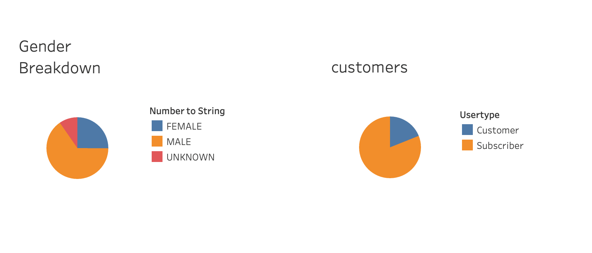

# Bikesharing

## Purpose of Analysis

This project is an analysis of New York Citi Sharing Bike data. We are creating a set of visualizations to show the length of time that bikes are checked out for all riders and genders, show the number of bike trips for all riders and genders for each hour of each day of the week, and show the number of bike trips for each type of user and gender for each day of the week.

## Resources:

Data Source: Citi Bike Data, 201908-citibike-tripdata.csv.zip
Software: Python 3.7.7, Anaconda Navigator 1.9.12, Conda 4.8.4, Jupyter Notebook 6.0.3, Tableau Public 2020.3.2

## Results 

Tableau NYC City Bike story link:

[https://public.tableau.com/app/profile/liza.lyadova/viz/NYCCityBike_16371758177270/NYCCityBikeStory?publish=yes](https://public.tableau.com/app/profile/liza.lyadova/viz/NYCCityBike_16371758177270/NYCCityBikeStory?publish=yes)

## Overview 

- There were 2,344,224  rides for the month of August 2019.
- 1,900,359 users were subscribers, 443,865 users were customers.
- 1,530,272 male users, 588,431 female users.

- There is a wide range of the age of the users. Younger users taking longer rides.
- In general, the later the birth year, the longer the ride duration. 

- 5:00 p.m to 7:00 p.m. are the top riding hours during August in New York City
- 2:00 a.m. to 5:00 a.m best time for bike maintenance to be performed

- Bikes are mostly checked out for 4 to 6 hours

- Male users take approximately 3 times more rides than the female users

- Most weekday rides are around 7:00 AM to 9 AM and 5:00 PM to 7:00 PM 
- Weekend rides are highest from 10:00 AM to 7:00 PM

- Busiest bike use location is Midtown Manhattan 

## Summary:

The data shows the activity of the bike sharing service in New York during the month of August 2019. The far majority of the rides were taken by male users during morning, evening, and weekends. 
Additional visualizations are suggested for future analysis:
- Compare data with different months of the year to see how different weather affect the bike use.
-  Average distance for trip. 
